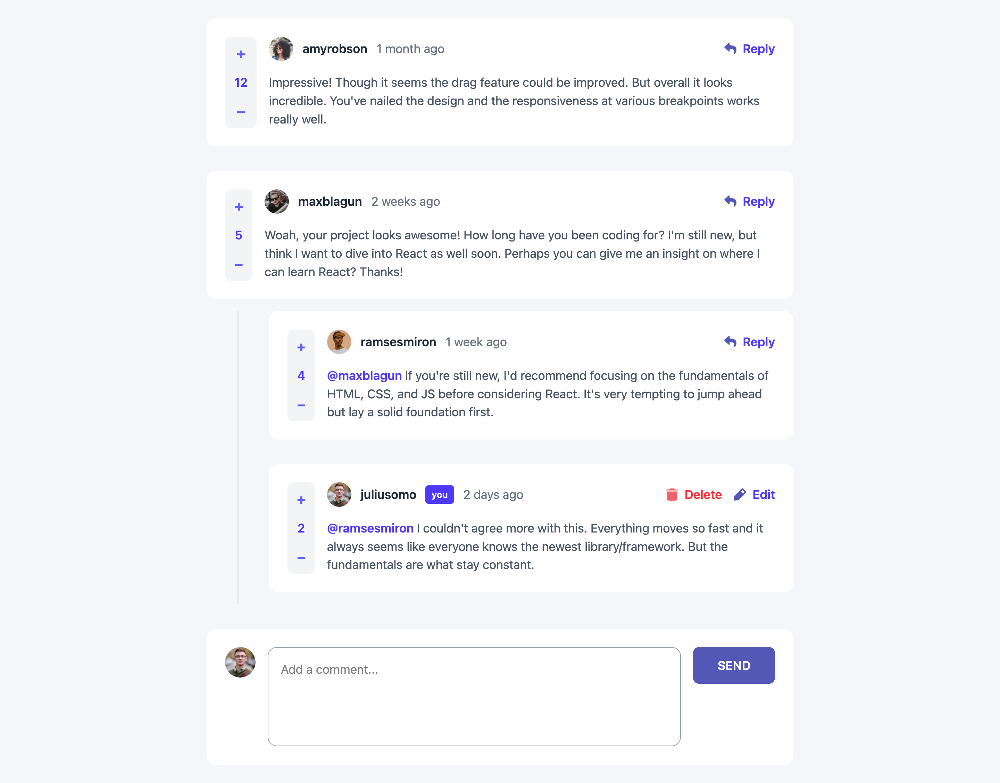

# Frontend Mentor - Interactive comments section

This is a solution to the [Interactive comments section challenge on Frontend Mentor](https://www.frontendmentor.io/challenges/interactive-comments-section-iG1RugEG9). Frontend Mentor challenges help you improve your coding skills by building realistic projects. 

## Table of contents

- [Frontend Mentor - Interactive comments section](#frontend-mentor---interactive-comments-section)
  - [Table of contents](#table-of-contents)
  - [Overview](#overview)
  - [The Challenge](#the-challenge)
    - [Screenshot](#screenshot)
    - [Links](#links)
  - [My process](#my-process)
    - [Built with](#built-with)
    - [What I learnt](#what-i-learnt)
    - [Continued Development](#continued-development)
  - [Author](#author)
  
## Overview

## The Challenge

Users should be able to

- View the optimal layout for the app depending on their device's screen size
- See hover states for all interactive elements on the page
- Create, Read, Update, and Delete comments and replies
- Upvote and downvote comments

### Screenshot



### Links

- Solution URL: [Add solution URL here](https://your-solution-url.com)
- Live Site URL: [https://interactive-comments-section-black.vercel.app/]

## My process

### Built with

- React
- Tailwindcss

### What I learnt

- Managing complex nested state, lifting state up to parent components, and passing data/functions through props to child components.
- Implementing Create (add comments/replies), Read (display comments), Update (edit content), and Delete operations on nested data structures
- Building self-referencing components and recursive functions to handle tree-like data structures (nested comments) at unlimited depth levels
- Working with controlled inputs, form submissions, preventing default behavior, data persistence across page refreshes, and responsive design patterns using Tailwind CSS breakpoints.

```
// Recursive component rendering
<Comment comment={reply} onAddReply={onAddReply} />

// Recursive data traversal
const updateReplies = (comments) => 
    comments.map(comment => 
        comment.id === targetId 
            ? { ...comment, replies: [...comment.replies, newReply] }
            : { ...comment, replies: updateReplies(comment.replies) }
    );

// Controlled inputs
<textarea value={text} onChange={(e) => setText(e.target.value)} />

// Conditional rendering
{isEditing ? <EditForm /> : <CommentText />}

// localStorage persistence
useEffect(() => {
    localStorage.setItem('comments', JSON.stringify(comments));
}, [comments]);

```

### Continued Development

1. **UX Improvements**: Persist votes to localStorage, add character counters, implement comment sorting (latest/popular/oldest), and add search/filter functionality.

2. **Advanced Features**: Add markdown support for text formatting, implement @mention autocomplete, add real-time timestamps with date-fns, and set nested reply depth limits.

3. **Backend Integration**: Connect to Firebase/Supabase for real-time database, add user authentication (Google/email login), implement notifications when users get replies.

4. **Architecture & Performance**: Refactor with Context API to avoid prop drilling, convert to TypeScript for type safety, add unit tests with Vitest, implement lazy loading and optimistic UI updates.

5. **Polish**: Add dark mode theme toggle, animations with Framer Motion, accessibility features (ARIA labels, keyboard navigation), and admin moderation tools.

## Author

- Website - [Work in progress](https://www.your-site.com)
- Frontend Mentor - [JohnsonWalker-cmd](https://www.frontendmentor.io/profile/JohnsonWalker-cmd)
- Twitter - [walkerthecutev](https://x.com/walkerthecutev)


